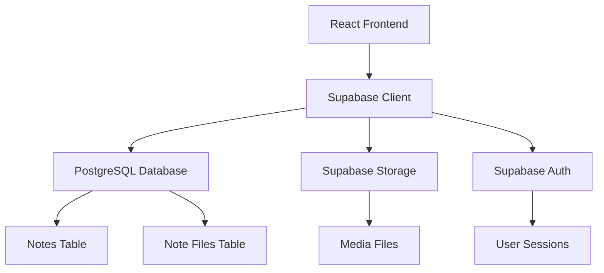

# 📝 Supanotes - Advanced Note-Taking Web App

<div align="center">


**A modern, feature-rich note-taking application built with React, TypeScript, and Supabase**

[](https://reactjs.org/)
[](https://www.typescriptlang.org/)
[](https://supabase.com/)
[](https://tailwindcss.com/)
[](https://vitejs.dev/)
[](LICENSE)

[🚀 Live Demo](https://your-demo-url.netlify.app) • [📖 Documentation](https://github.com/yourusername/supanotes/wiki) • [🐛 Report Bug](https://github.com/yourusername/supanotes/issues) • [✨ Request Feature](https://github.com/yourusername/supanotes/issues)

</div>

---

## 🌟 Overview

Supanotes is a comprehensive note-taking solution that combines the simplicity of traditional note apps with powerful modern features. Whether you're a student, professional, or creative, Supanotes adapts to your workflow with support for text, images, audio, and mixed-media content.

### 🎯 Key Highlights

- **🚀 Lightning Fast** - Built with modern React and optimized for performance
- **🔒 Secure & Private** - Your data is protected with enterprise-grade security
- **📱 Cross-Platform** - Works seamlessly on desktop, tablet, and mobile
- **🌐 Real-time Sync** - Access your notes anywhere, anytime
- **🎨 Beautiful UI** - Clean, intuitive design with dark/light themes

---

## ✨ Features

<table>
<tr>
<td width="50%">

### 📝 **Rich Content Creation**
- **Text Notes** with Markdown support
- **Image Notes** with captions and previews
- **Audio Notes** with playback controls
- **Mixed Media** notes combining all types
- **Smart Tagging** for organization
- **Auto-save** functionality

</td>
<td width="50%">

### 🔍 **Advanced Organization**
- **Instant Search** across all content
- **Smart Filters** by type, date, tags
- **Sorting Options** (newest, oldest)
- **Dashboard Analytics** and insights
- **Export Capabilities** for backup
- **Bulk Operations** for efficiency

</td>
</tr>
</table>

### 🎨 **User Experience**
- **Responsive Design** - Perfect on any device
- **Dark/Light Themes** - Easy on the eyes
- **Keyboard Shortcuts** - Power user friendly
- **Drag & Drop** - Intuitive file uploads
- **Real-time Preview** - See changes instantly
- **Progressive Enhancement** - Basic to advanced features

### 🔐 **Security & Authentication**
- **Multiple Login Options** - Email, Google OAuth
- **Row-Level Security** - Your data stays private
- **Secure File Storage** - Protected media uploads
- **Session Management** - Automatic security handling
- **Data Encryption** - End-to-end protection

---

## 📸 Screenshots

<div align="center">

### 🏠 Dashboard Overview

*Clean, organized dashboard with all your notes at a glance*

### ✍️ Note Creation Interface

*Intuitive note creation with support for multiple content types*

### 🔍 Search & Filter System

*Powerful search and filtering capabilities*

### 🎨 Preview Modal

*Full-screen preview with zoom and playback controls*

### 📱 Mobile Responsive Design

*Optimized mobile experience*

</div>

---

## 🚀 Quick Start

### 📋 Prerequisites

Before you begin, ensure you have the following installed:

- **Node.js** (v16 or higher) - [Download here](https://nodejs.org/)
- **npm** or **yarn** - Comes with Node.js
- **Git** - [Download here](https://git-scm.com/)
- **Supabase Account** - [Sign up free](https://supabase.com/)

### ⚡ Installation

1. **Clone the repository**
   ```bash
   git clone https://github.com/Xenonesis/Supanotes.git
   cd Supanotes
   ```

2. **Install dependencies**
   ```bash
   npm install
   # or
   yarn install
   ```

3. **Set up Supabase**
   
   Create a new Supabase project and configure:
   
   ```bash
   # Copy environment template
   cp .env.example .env
   ```
   
   Add your Supabase credentials to `.env`:
   ```env
   VITE_SUPABASE_URL=your_supabase_project_url
   VITE_SUPABASE_ANON_KEY=your_supabase_anon_key
   ```

4. **Database Setup**
   
   Run the SQL setup in your Supabase dashboard:
   - Go to **SQL Editor**
   - Copy and paste contents from `database_setup.sql`
   - Click **Run**

5. **Storage Configuration**
   
   Set up file storage:
   - Go to **Storage** in Supabase
   - Create bucket named `notes-media`
   - Make it public
   - Apply policies from `supabase_storage_setup.md`

6. **Start the development server**
   ```bash
   npm run dev
   # or
   yarn dev
   ```

7. **Open your browser**
   
   Visit `http://localhost:5173` to see your app! 🎉

---

## 📖 Usage Guide

### 📝 Creating Your First Note

<details>
<summary><strong>📄 Text Notes</strong></summary>

1. Click the **"Text"** tab in the note form
2. Enter your content (Markdown supported!)
3. Add tags for organization (optional)
4. Click **"Add Note"**

**Markdown Support:**
- `**bold text**` → **bold text**
- `*italic text*` → *italic text*
- `# Heading` → Large heading
- `- List item` → Bullet points

</details>

<details>
<summary><strong>🖼️ Image Notes</strong></summary>

1. Click the **"Image"** tab
2. Drag & drop or click to upload images
3. Add a descriptive caption
4. Tag for easy finding later
5. Click **"Add Image Note"**

**Supported Formats:** JPEG, PNG, GIF, WebP (max 10MB)

</details>

<details>
<summary><strong>🎵 Audio Notes</strong></summary>

1. Click the **"Audio"** tab
2. Upload your audio file
3. Add a description or transcript
4. Tag appropriately
5. Click **"Add Audio Note"**

**Supported Formats:** MP3, WAV, OGG, MP4, WebM (max 10MB)

</details>

<details>
<summary><strong>🎭 Mixed Media Notes (Enhanced)</strong></summary>

1. Click the **"Mixed"** tab
2. Add text content
3. Upload multiple images and/or audio files
4. Organize with relevant tags
5. Mark as favorite if important
6. Click **"Add Mixed Note"**

Perfect for meeting notes, project documentation, or creative projects!

</details>

### 🔍 Finding Your Notes

- **🔎 Search Bar** - Type to search through all content
- **🏷️ Tag Filter** - Click tags to filter by category
- **📅 Date Sort** - Sort by newest or oldest first
- **📁 Type Filter** - Show only specific note types
- **⭐ Favorites** - Quick access to starred notes
- **⚡ Quick Actions** - Edit, delete, or download from note cards

---

## 🛠️ Technology Stack

<div align="center">

| Category | Technologies |
|----------|-------------|
| **Frontend** |    |
| **Backend** |   |
| **Build Tools** |   |
| **UI/UX** |   |

</div>

### 🏗️ Architecture Overview



---

## 📁 Project Structure

```
supanotes/
├── 📁 src/
│   ├── 📁 components/
│   │   ├── 📁 Auth/              # 🔐 Authentication components
│   │   │   ├── AuthPage.tsx      # Main auth page
│   │   │   ├── LoginForm.tsx     # Login form
│   │   │   └── SignUpForm.tsx    # Registration form
│   │   ├── 📁 Dashboard/         # 📊 Main app components
│   │   │   ├── EnhancedDashboard.tsx        # Main dashboard
│   │   │   ├── EnhancedBasicDashboard.tsx   # Basic dashboard
│   │   │   ├── EnhancedNoteForm.tsx         # Note creation form
│   │   │   ├── EnhancedNoteCard.tsx         # Note display card
│   │   │   ├── NotesSearchFilter.tsx        # Search & filter
│   │   │   ├── EditNoteModal.tsx            # Edit modal
│   │   │   └── NotePreviewModal.tsx         # Preview modal
│   │   └── 📁 ui/                # 🎨 Reusable UI components
│   │       ├── Button.tsx        # Custom button
│   │       ├── Card.tsx          # Card component
│   │       ├── Input.tsx         # Input component
│   │       ├── Logo.tsx          # App logo
│   │       └── ThemeToggle.tsx   # Theme switcher
│   ├── 📁 contexts/              # ⚡ React contexts
│   │   ├── AuthContext.tsx       # Authentication state
│   │   └── ThemeContext.tsx      # Theme management
│   ├── 📁 hooks/                 # 🪝 Custom React hooks
│   │   ├── useEnhancedNotes.ts   # Enhanced notes logic
│   │   ├── useCompatibleNotes.ts # Compatibility layer
│   │   └── useNotes.ts           # Basic notes hook
│   ├── 📁 lib/                   # 🔧 Utilities and config
│   │   ├── supabase.ts           # Supabase client
│   │   ├── fileUpload.ts         # File upload utilities
│   │   └── utils.ts              # Helper functions
│   ├── App.tsx                   # 🏠 Main app component
│   ├── main.tsx                  # 🚀 App entry point
│   └── index.css                 # 🎨 Global styles
├── 📁 public/                    # 📂 Static assets
├── 📄 database_setup.sql         # 🗄️ Database schema
├── 📄 enhanced_notes_setup.sql   # 🚀 Enhanced features schema
├── 📄 supabase_storage_setup.md  # 💾 Storage configuration
├── 📄 package.json               # 📦 Dependencies
├── 📄 vite.config.ts             # ⚙️ Vite configuration
├── 📄 tailwind.config.js         # 🎨 Tailwind config
└── 📄 README.md                  # 📖 This file
```

---

## 🔧 Configuration

### 🌍 Environment Variables

Create a `.env` file in the root directory:

```env
# Supabase Configuration
VITE_SUPABASE_URL=https://your-project.supabase.co
VITE_SUPABASE_ANON_KEY=your-anon-key-here

# Optional: Custom Configuration
VITE_APP_NAME=Supanotes
VITE_MAX_FILE_SIZE=10485760  # 10MB in bytes
```

### 📊 Database Schema

The application uses these main tables:

<details>
<summary><strong>Basic Schema (database_setup.sql)</strong></summary>

```sql
-- Notes table
CREATE TABLE notes (
  id UUID DEFAULT gen_random_uuid() PRIMARY KEY,
  user_id UUID REFERENCES auth.users(id) ON DELETE CASCADE,
  content TEXT,
  content_type VARCHAR(20) DEFAULT 'text',
  created_at TIMESTAMP WITH TIME ZONE DEFAULT NOW(),
  updated_at TIMESTAMP WITH TIME ZONE DEFAULT NOW()
);

-- Note files table
CREATE TABLE note_files (
  id UUID DEFAULT gen_random_uuid() PRIMARY KEY,
  note_id UUID REFERENCES notes(id) ON DELETE CASCADE,
  file_name TEXT NOT NULL,
  file_path TEXT NOT NULL,
  file_type VARCHAR(50),
  file_size INTEGER,
  created_at TIMESTAMP WITH TIME ZONE DEFAULT NOW()
);
```

</details>

<details>
<summary><strong>Enhanced Schema (enhanced_notes_setup.sql)</strong></summary>

```sql
-- Enhanced notes table with additional features
ALTER TABLE notes ADD COLUMN IF NOT EXISTS title TEXT;
ALTER TABLE notes ADD COLUMN IF NOT EXISTS tags TEXT[];
ALTER TABLE notes ADD COLUMN IF NOT EXISTS is_favorite BOOLEAN DEFAULT FALSE;

-- Enhanced note files with captions
ALTER TABLE note_files ADD COLUMN IF NOT EXISTS caption TEXT;
ALTER TABLE note_files ADD COLUMN IF NOT EXISTS file_order INTEGER DEFAULT 0;
```

</details>

### 📁 File Upload Configuration

```typescript
// File size limits and types
export const FILE_CONFIG = {
  maxSize: 10 * 1024 * 1024, // 10MB
  allowedImageTypes: ['image/jpeg', 'image/png', 'image/gif', 'image/webp'],
  allowedAudioTypes: ['audio/mpeg', 'audio/wav', 'audio/ogg', 'video/mp4', 'video/webm']
}
```

---

## 🔄 Progressive Enhancement

Supanotes uses a progressive enhancement approach:

### 📊 Feature Comparison

| Feature | Basic Mode | Enhanced Mode |
|---------|------------|---------------|
| Text Notes | ✅ | ✅ |
| Image Notes | ✅ | ✅ |
| Audio Notes | ✅ | ✅ |
| Mixed Content | ❌ | ✅ |
| Tagging System | ❌ | ✅ |
| Favorites | ❌ | ✅ |
| Advanced Search | ❌ | ✅ |
| Statistics | ❌ | ✅ |

### 🚀 Upgrading to Enhanced Mode

1. **Automatic Detection** - App detects your current schema
2. **Upgrade Banner** - Shows when enhanced features are available
3. **One-Click Setup** - Download and run the enhanced SQL script
4. **Seamless Transition** - Existing notes remain unchanged

---

## 🚀 Deployment

### 🌐 Netlify (Recommended)

[](https://app.netlify.com/start/deploy?repository=https://github.com/Xenonesis/Supanotes)

1. **Connect Repository**
   - Link your GitHub repository to Netlify
   - Choose the main branch

2. **Build Settings**
   ```
   Build command: npm run build
   Publish directory: dist
   ```

3. **Environment Variables**
   - Add your Supabase URL and anon key
   - Set any custom configuration

4. **Deploy!**
   - Your app will be live in minutes

### ⚡ Vercel

[](https://vercel.com/new/clone?repository-url=https://github.com/Xenonesis/Supanotes)

1. **Import Project**
   - Connect your GitHub account
   - Import the repository

2. **Configure**
   - Build settings are auto-detected
   - Add environment variables

3. **Deploy**
   - Automatic deployments on every push

### 🐳 Docker (Advanced)

```dockerfile
FROM node:18-alpine AS builder
WORKDIR /app
COPY package*.json ./
RUN npm ci
COPY . .
RUN npm run build

FROM nginx:alpine
COPY --from=builder /app/dist /usr/share/nginx/html
EXPOSE 80
CMD ["nginx", "-g", "daemon off;"]
```

---

## 🔒 Security Features

### 🛡️ Data Protection
- **Row Level Security (RLS)** - Users can only access their own data
- **File Access Control** - Secure file storage with user-specific permissions
- **Input Validation** - Comprehensive client and server-side validation
- **SQL Injection Protection** - Parameterized queries and ORM protection

### 🔐 Authentication Security
- **JWT Tokens** - Secure session management
- **OAuth Integration** - Google and other providers
- **Password Hashing** - Secure password storage
- **Session Timeout** - Automatic logout for security

### 🌐 Network Security
- **HTTPS Only** - Encrypted data transmission
- **CORS Protection** - Proper cross-origin resource sharing
- **Rate Limiting** - Protection against abuse
- **Content Security Policy** - XSS protection

---

## 🧪 Testing

### 🔧 Running Tests

```bash
# Run all tests
npm test

# Run tests in watch mode
npm run test:watch

# Run tests with coverage
npm run test:coverage

# Run linting
npm run lint
```

### 🎯 Test Coverage Areas

- **Unit Tests** - Component and utility function testing
- **Integration Tests** - API and database interaction testing
- **E2E Tests** - Full user workflow testing
- **Performance Tests** - Load and stress testing

---

## 🤝 Contributing

We love contributions! Here's how you can help make Supanotes even better:

### 🌟 Ways to Contribute

- 🐛 **Report Bugs** - Found an issue? Let us know!
- ✨ **Suggest Features** - Have a great idea? Share it!
- 📝 **Improve Documentation** - Help others understand the project
- 🔧 **Submit Code** - Fix bugs or add features
- 🎨 **Design Improvements** - Make the UI even more beautiful

### 📋 Contribution Process

1. **Fork the Repository**
   ```bash
   git clone https://github.com/Xenonesis/Supanotes.git
   cd Supanotes
   ```

2. **Create a Feature Branch**
   ```bash
   git checkout -b feature/amazing-feature
   ```

3. **Make Your Changes**
   - Write clean, documented code
   - Add tests for new features
   - Follow the existing code style

4. **Test Your Changes**
   ```bash
   npm test
   npm run lint
   ```

5. **Commit and Push**
   ```bash
   git commit -m 'Add amazing feature'
   git push origin feature/amazing-feature
   ```

6. **Open a Pull Request**
   - Describe your changes clearly
   - Link any related issues
   - Wait for review and feedback

### 📏 Code Style Guidelines

- Use TypeScript for type safety
- Follow React best practices
- Write meaningful commit messages
- Add JSDoc comments for functions
- Use Prettier for code formatting

---

## 📈 Roadmap

### 🎯 Upcoming Features

- [ ] **📱 Mobile App** - Native iOS and Android apps
- [ ] **🤝 Collaboration** - Share and collaborate on notes
- [ ] **📊 Advanced Analytics** - Detailed usage insights
- [ ] **🔄 Sync Improvements** - Offline-first architecture
- [ ] **🎨 Custom Themes** - User-created theme support
- [ ] **📤 More Export Options** - PDF, Word, etc.
- [ ] **🔍 Advanced Search** - Full-text search with filters
- [ ] **📝 Rich Text Editor** - WYSIWYG editing experience

### 🗓️ Release Schedule

- **v2.0** - Mobile apps and collaboration (Q2 2024)
- **v2.1** - Advanced analytics and insights (Q3 2024)
- **v2.2** - Offline support and sync improvements (Q4 2024)

---

## 📞 Support

### 🆘 Getting Help

- **📖 Documentation** - Check our [Wiki](https://github.com/Xenonesis/Supanotes/wiki)
- **💬 Discussions** - Join our [GitHub Discussions](https://github.com/Xenonesis/Supanotes/discussions)
- **🐛 Issues** - Report bugs on [GitHub Issues](https://github.com/Xenonesis/Supanotes/issues)
- **📧 Email** - Contact us at support@supanotes.com

### ❓ FAQ

<details>
<summary><strong>How do I reset my password?</strong></summary>

Use the "Forgot Password" link on the login page. You'll receive an email with reset instructions.

</details>

<details>
<summary><strong>What's the file size limit?</strong></summary>

Currently, files are limited to 10MB each. This can be configured in the settings.

</details>

<details>
<summary><strong>Can I export my data?</strong></summary>

Yes! You can download individual files or export all your notes from the dashboard.

</details>

<details>
<summary><strong>Is my data secure?</strong></summary>

Absolutely! We use enterprise-grade security with encryption, secure authentication, and privacy protection.

</details>

<details>
<summary><strong>How do I enable enhanced features?</strong></summary>

The app will show an upgrade banner when enhanced features are available. Simply download and run the enhanced SQL script in your Supabase dashboard.

</details>

---

## 🛠️ Development

### 📋 Available Scripts

```bash
# Development
npm run dev          # Start development server
npm run build        # Build for production
npm run preview      # Preview production build

# Code Quality
npm run lint         # Run ESLint
npm run type-check   # TypeScript type checking

# Testing
npm test            # Run tests
npm run test:watch  # Run tests in watch mode
```

### 🔧 Development Tips

- Use browser dev tools to check network requests
- Check Supabase logs for detailed error messages
- Test with different file types and sizes
- Verify database schema matches the application code
- Use React Developer Tools for debugging

---

## 📄 License

This project is licensed under the **MIT License** - see the [LICENSE](LICENSE) file for details.

```
MIT License

Copyright (c) 2024 Supanotes

Permission is hereby granted, free of charge, to any person obtaining a copy
of this software and associated documentation files (the "Software"), to deal
in the Software without restriction, including without limitation the rights
to use, copy, modify, merge, publish, distribute, sublicense, and/or sell
copies of the Software, and to permit persons to whom the Software is
furnished to do so, subject to the following conditions:

The above copyright notice and this permission notice shall be included in all
copies or substantial portions of the Software.
```

---

## 🙏 Acknowledgments

Special thanks to the amazing open-source community and these fantastic projects:

- **[Supabase](https://supabase.com/)** - The open source Firebase alternative
- **[React](https://reactjs.org/)** - A JavaScript library for building user interfaces
- **[TypeScript](https://www.typescriptlang.org/)** - JavaScript with syntax for types
- **[Tailwind CSS](https://tailwindcss.com/)** - A utility-first CSS framework
- **[Vite](https://vitejs.dev/)** - Next generation frontend tooling
- **[Lucide React](https://lucide.dev/)** - Beautiful & consistent icon toolkit

---

<div align="center">

**Made with ❤️ by the Supanotes Team**

[⭐ Star this repo](https://github.com/Xenonesis/Supanotes) • [🐦 Follow us on Twitter](https://twitter.com/supanotes) • [💼 LinkedIn](https://linkedin.com/company/supanotes)

</div>